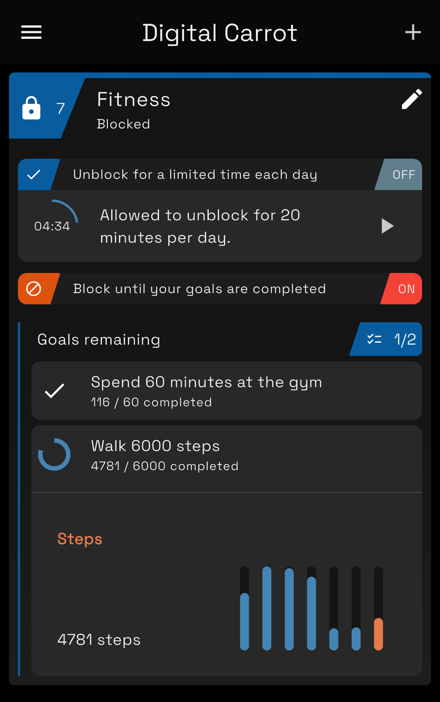
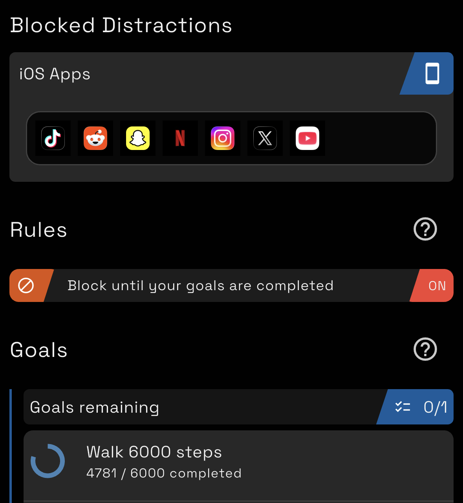
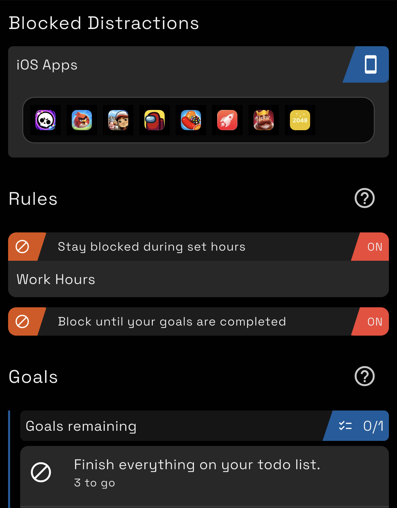
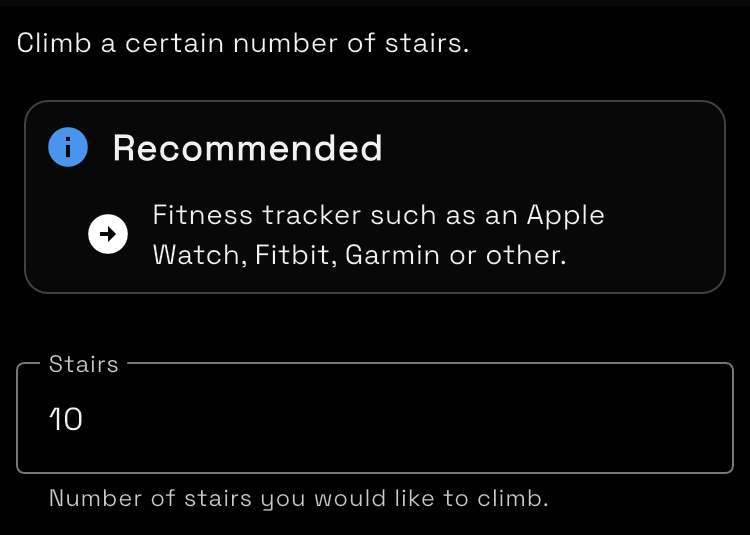
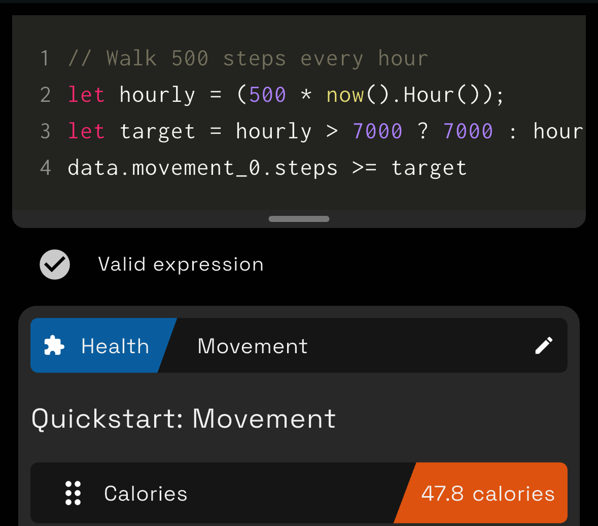
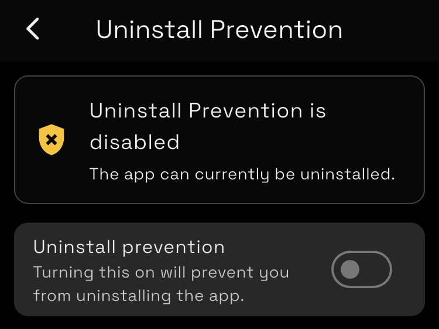
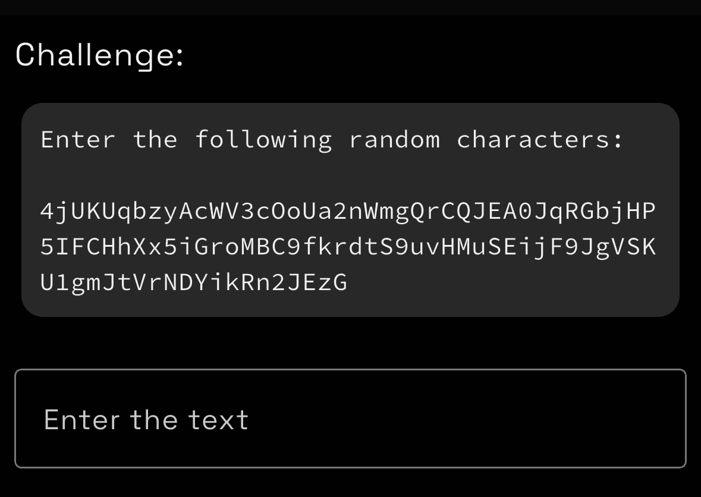
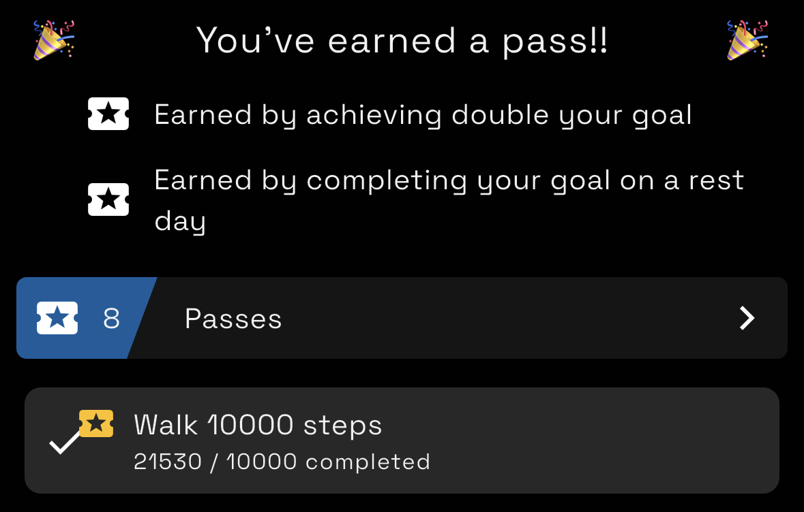
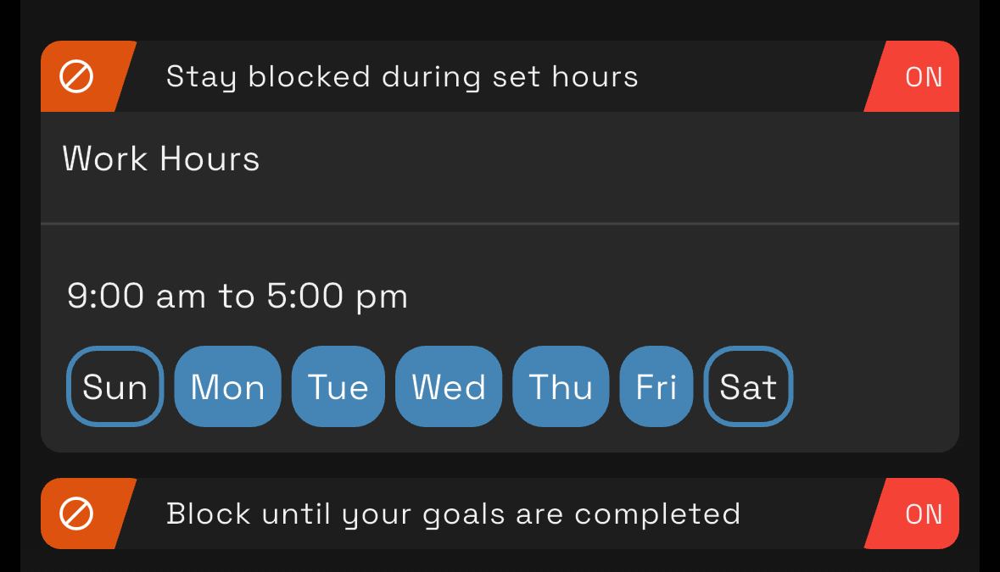

## Introduction

I wanted to get in shape before my honeymoon back in 2025 so that I would look good in pictures and be able to handle all of the walking my wife and I were planning. I created a Python script that read how many steps I took each day from my Garmin watch and then blocked youtube until I hit 10,000 steps. This was wildly successful, helping me lose 20lb as well as get some of my focus back! I decided to that this was a product worth sharing with the world, so I created Digital Carrot.

Digital Carrot is a focus app, app blocker and productivity tool. It motivates you to achieve your goals by blocking apps, websites and video games until you achieve whatever goals you set for yourself. Goals are all set and checked pragmatically. If you set a goal to walk a certain number of steps, the app will check how many steps you actually walked in Apple or Google health.

For example you can:

- Block Instagram until you walk 10,000 steps
- Block League of Legends until the heat death of the universe because LoL is consuming your soul and you're better off without it
- Allow yourself 30 minutes a day to browse Reddit
- Block TikTok until you spend 60 minutes at the gym

  

Everyone has their own set of goals that they want to achieve, so the app is designed from the ground up to be as customizable as possible. It features a plugin system that allows the app to be extended to fetch data for creating goals from anywhere. Goals are then defined pragmatically using a very simple scripting system. You can create goals using quick start templates or define your own.

 

## Features

### PC, Mobile and Sync

Digital Carrot is more than just a mobile app!

It's available on Windows and Mac as well as Android and iOS.

Having a PC version is personally very important to me because I'm what the kids refer to as an ["unc"](https://www.urbandictionary.com/define.php?term=Unc.) who prefers to watch YouTube on his laptop.

The app has an optional paid feature to sync your goals and blocked items across all your devices. Sync is fully end to end encrypted. I ended up developing my own sync system rather than relying on iCloud or Dropbox for the following reasons:

- Sync has to be FAST. Some data (such as Apple Watch information) is only available on your phone. When you complete your step goal, you DESERVE to be rewarded right away on your computer. You can't wait around for the iCloud gremlins to wake up when there's brain rot to be had! 
- Sync has to support all devices. I have a gaming PC, MacBook and iPhone. Services like iCloud won't sync to Windows.
- Sync MUST be PRIVATE. iCloud has good encryption policies, but the only way to guarantee security is to do it myself.

Plus building a high performance, end to end encrypted sync was a lot of fun!

### Commitment Mode - Keep yourself from cheating

Commitment mode allows you to lock down your configuration with a challenge. Right now this includes:

- Entering a long string of random text
- Putting in a password

As with everything else in the app, unlock challenges are configurable via plugins, so these can be customized to whatever you want!

The app also features uninstall prevention to keep you from cheating by just uninstalling the app.

 

### Passes - Take a break when you need one

One issue I ran into from the beginning was that there are just some days that I can't accomplish my goals. This could be because I got sick, was traveling or just wanted some extra time to play Abiotic Factor with my buddies. Getting sick was especially problematic, because I would end up disabling my website blocker and then never re-enable it.

The fix here is passes. Passes can be:

- Awarded on a monthly basis
- Earned by completing a goal on a rest day
- Earned by completing 2x your goal (such as by walking 20,000 steps on a 10,000 step goal)

You can spend a pass to skip your goal for a day if you need to.

Passes will be able to be configured pragmatically in an upcoming update! This means you'll be able to do things such give yourself a pass if it's raining or if the price of Bitcoin goes to the moon.

### Rules - Configure how and when your distractions are blocked

Rules let you define conditions when your blocked items are either blocked or unblocked. You can use a rule to always block everything during work hours or to unblock a block list for 30 minutes each day.

Rules are also customize-able. If you wanted to, you could create a rule that unblocks Twitch when your favorite streamer is live! 

### Plugins - Create goals from anything

Plugins allow you to bring any information you want into the app. If you'd like to contribute a plugin there's [documentation for it here](https://www.digitalcarrot.app/docs/developers/).

## Download the App

Get the app at [www.digitalcarrot.app](https://www.digitalcarrot.app/)

## Pricing

The app is 100% free on PC (Windows and Mac).

The mobile version is freemium with some features locked behind a paywall. You can unlock all the features on mobile for a $30 one time payment.

Sync is available with a $60/yr or $8/mo subscription.

The app is priced this way for the following reasons:
- I have to pay a developer fee to distribute to Android and iOS, which is offset by the freemium model
- The desktop version is required for people to develop plugins and I want anyone to be able to develop plugins without having to buy the app
- Sync is fairly expensive to maintain and requires me to constantly monitor the sync server
- I refuse to put ads in the app or to sell user data. Charging a small fee for the app allows me to keep maintaining it while also respecting my user's time and privacy

I really appreciate everyone who chooses to pay for the app! It's built by one person, and my dream is to be able to make a living supporting the app.
