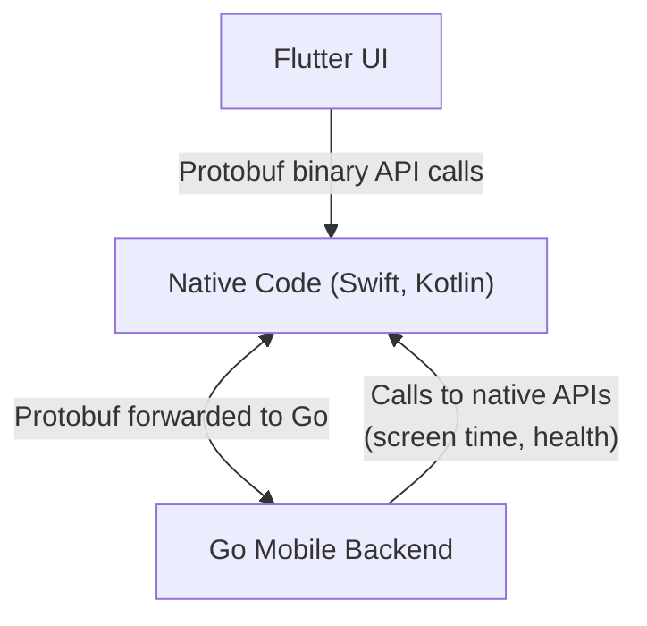

I have been developing Digital Carrot with Go Mobile for the last year and it has been a largely positive experience. This article is meant to serve as a repository of everything I've learned throughout the process.

## Why did I choose Go Mobile?

The short answer is that I really like Go and wanted to use it. The longer answer is that is some combination of the following:

- Digital Carrot is a cross platform application, and I wanted something that I could easily compile and run anywhere.
- Go has a strong library of system features that I wanted to use to make Digital Carrot customizable and pluggable. Chief among these are Expr (for building expressions) and Goja (for creating JavaScript plugins).

## How am I using Go Mobile?

Go mobile is used for all the business logic for Digital Carrot. While I would have loved to use Fyne for the UI, I gave it a try and decided it just isn't quite mature enough. Instead, I opted to use Flutter with a Go backend

Here is more or less what it looks like:

- Flutter calls into Switf/Kotlin using [platform channels](https://docs.flutter.dev/platform-integration/platform-channels)
	- API calls are binary encoded protobuf messages
	- Native code forwards the raw binary to Go
	- Go decodes the protobuf messages and responds
- Go can also call native code via interfaces when it needs to interact with native APIs



### Flutter to Go Communication

As mentioned above, Flutter communicates with Go using Protobuf messages. Protobuf is a MUST here as it allows me to work with nice structs/classes in Go and Dart without having to do a lot of manual marshalling and unmarshalling of JSON objects. I can define my messages in Protobuf and automatically get nice objects in Dart and Go to work with. Communication between Flutter, platform code and Go can only be done with basic data types (strings, binary, booleans, etc) so Protobuf messages are perfect for this use case.

Defining new platform channels is also a huge chore in Flutter since they need to be defined in three places (Flutter, platform and Go), so I ended up going with a single function that handles all API calls. This function passes a message with a large `oneof` block to define the actual API call. It looks something like this:

```protobuf
message CarrotAPI {
  oneof api {
    Function1API function1 = 10;
    Function2API function2 = 11;
  }
}
```

Each function call in the `oneof` block looks something like this:

```protobuf
message Function1API {
	message Request {}
	message Response {}
	
	Request request = 1;
	Response response = 2;
}
```

Flutter populates the `request` part of the message, throws it in the `CarrotAPI` object and sends it to Go. Go can tell what function is being called through a switch statement on `CarrotAPI.api` and populate the correct response. This is a little clunky, but it's much better than creating new platform channels for every function and saves a lot of work that would otherwise need to be duplicated across Swift and Kotlin.

I won't go into specifics on how to implement this. There are [other articles](https://medium.com/flutter-community/using-go-library-in-flutter-a04e3496aa05) that do a better job of explaining how this works.

### Go to Swift/Kotlin Communication

This is one area that I struggled with for a long time because this is not documented well in Go. Essentially, to send messages from Go to platform code you need to create a Go interface that is then implemented on the platform side and passed into Go when the Go code is invoked. Here's an example:

We create a Go interface like this:

```go
type IosMethods interface {
	// Screentime
	SetShields([]byte) bool
	HasScreentimePermissions() bool
}
```

Go Mobile generates an objective C or Kotlin interface like this:

```
@interface MobileIosMethods : NSObject <goSeqRefInterface, MobileIosMethods> {
}
@property(strong, readonly) _Nonnull id _ref;
- (BOOL)hasScreentimePermissions;
- (BOOL)setShields:(NSData* _Nullable)p0;
@end
```

Which we can implement in Swift or Kotlin and pass back into Go:

```swift
class GoScreentime: NSObject, MobileIosMethodsProtocol {
    public func setShields(_ p0: Data?) -> Bool {
        return setShieldsFromJSONBytes(p0)
    }

    public func hasScreentimePermissions() -> Bool {
        return AuthorizationCenter.shared.authorizationStatus == .approved
    }
}
```

```swift
@main
@objc class AppDelegate: FlutterAppDelegate {
    override func application(
        _ application: UIApplication,
        didFinishLaunchingWithOptions launchOptions: [UIApplication.LaunchOptionsKey: Any]?
    ) -> Bool {
        [...]

        self.carrotApi = DigitalCarrot.MobileNewAppleMobileAPI(
            GoScreentime()
        )
		
		[...]
    }
}
```

Once again, these interfaces only support primitive data types. This is another area where Protobuf could be helpful, but I didn't end up using it since there aren't many calls that need to be made from Go to the platform code.

More information about this can be found in this [excellent article](https://medium.com/@matryer/tutorial-calling-go-code-from-swift-on-ios-and-vice-versa-with-gomobile-7925620c17a4).

## How is all of this working out?

So far I really like this stack. Working with Go is such a pleasure, so that alone is well worth it to me. Beyond my personal weirdness, this approach has some serious pros and cons.

### The Good

#### Seamless integration with the server

The Digital Carrot sync server is also implemented in go. This makes testing sync a breeze because I can just import the client code directly into my server sync tests. I don't have to build any complicated test harnesses with docker to spin up client and server applications running on different stacks. I can literally just `go test` it on my Mac and the tests run in under 20 seconds.

#### Strong business/presentation layer boundary

This is mostly self explanatory. It's difficult to mix business logic with presentation logic because they are written in different languages. The Flutter component of the app just handles the UI (and some minor platform specific stuff such as requesting permissions) and the Go component handles all of the business logic (communicating with the server, saving data, validation, etc).

One real benefit is that testing the API contract is trivially easy. All of the business logic is tested in Go, which once again, means I don't have to spin up any complicated UI components to test the app. I can write integration tests in Go and just run them with `go test`. One unexpected benefit here has been replay testing. I can test the app manually in the UI, record the API calls that the UI makes and then run those API calls back programmatically. Some UI tests are still required, but they can be very minimal since we can assume that the app's business logic is rock solid.

This separation of concerns also means that it is really easy to replace the UI with something else in the future. If I wanted a more native experience, I could implement the iOS app in Swift UI and the Android app in Kotlin. This is really nice to have in my back pocket given Google's propensity for killing projects. I can be reasonably sure that Go will never disappear, but who can say what will happen in the wacky world of UI.

#### Large collection of libraries to pull from

This architecture means that I get access to the full suite of tools available to Go and Dart. The Dart ecosystem provides just about any utility I might want for interfacing with platform specific permissions and Go has a rich assortment of system programming and networking tools that I can pull from.

#### The business logic can run over any protocol

Putting all of my communication on a network capable interface such as protocol means that the backend can run just about anywhere. This has been hugely advantageous on Windows and Mac. On these platforms the backend runs as a daemon in the background and the UI connects to it via gRPC over sockets or pipes. Digital Carrot needs to continuously run in the background to be able to block programs and websites, so being able to just run the Go daemon on it's own is great since there is no need to load all of the UI cruft into memory. As a result Digital Carrot only needs on the order of 30-60mb of RAM to run in the background.

While this doesn't help much for Digital Carrot, this could also be an advantage for other types of apps. For example you could create a document editor that can run on a home server or locally on device by just pointing the UI to a different API on the network.

#### Future AI shenanigans?

I haven't experimented with this yet, but having all of the app's APIs be network capable means that any client can interface with it, such as an AI agent. If I wanted to add AI capabilities into the app I don't need to do some kludgey workaround where the AI clicks around in the app. I can just point the AI at the existing and well documented API. 

### The Bad

#### Performance

Every function call requires serializing and deserializing Protobuf messages. This adds a tiny amount of overhead on the order of maybe a few milliseconds. This is totally fine for an app like Digital Carrot, but would be unacceptable for something that is more performance sensitive like a game.

#### Complexity

Adding new business logic is harder. You need to define new Protobuf messages and wire them up in Go. The good news is that this also incentivizes me to think a little more carefully before implementing new functionality. This approach also means that you need to be comfortable with at least two programing languages and carry some extra tooling for compiling Protobuf messages in Dart and Go.

#### Larger app size

Go binaries are big. The whole backend takes up about 53mb uncompressed. Its hard to say how much space the app would save if it was purely written in Dart, but I'm willing to bet that it wouldn't be more than an extra megabyte. 

### The Ugly

#### Bi-directional communication

One gotcha that I ran into is that there isn't a great way to make calls from the Go application to Flutter. This is important for notifying when changes were made from sync or for sending notifications. Flutter has some tooling to allow this, but I could never get it to work reliably. In the end I just created a function that runs every second in Flutter and polls the backend for state changes. It's not an elegant or particularly good solution, but it was cheap and easy to implement so I don't imagine I'll be changing it.

#### Async

This was an issue that I didn't catch until the app was submitted for app review. The reviewer rejected the initial app submission on grounds that they noticed slight freezes in the UI. I don't know what kind of hardware Apple tests on to notice this because it was never noticeable to me, but it lead me down a bit of a rabbit hole. As it turns out, Flutter platform channel calls are not asynchronous by default! This means that any call to Go mobile would block the main Flutter thread and freeze the whole UI. In practice this was only noticeable if the backend had to perform an expensive operation such as fetching data from the web. This lead to some really ugly code where each call to go has to be handed off to a separate go routine that would call a callback to Flutter upon completion. This isn't a big deal in the greater scheme of things, but is a footgun that surprised me at the last minute and was somewhat complicated to fix.

#### Time zones and networking bugs

There is a long standing bug in Go mobile where the local time is always set to GMT. This caused me no shortage of issues until I finally caught it. The only solution at the time was to pass the time zone code into Go from Swift/Kotlin, which just feels wrong.

DNS lookup is also [completely broken in Go mobile on iOS](https://github.com/golang/go/issues/58416#issuecomment-3070442502) out of the box. It works in the simulator, but as soon as you try to run on a real device it throws all sorts of errors. This requires including the `libresolv` package in XCode, which took me days to figure out.

## Closing thoughts

Overall I am very happy with Go mobile. This wasn't an easy journey. Go mobile is still not used very often. There was a lot that I had to make up as I went, but aside from a few very minor bugs it all works really well.

I will happily use this architecture in any future mobile apps that I end up making. That said, I wouldn't recommend implementing the entirety of your business logic as default architecture. There are niche cases where this will work amazingly well. For example:

- If you have a team that already happens to be very comfortable with Go.
- Apps rely heavily on Go network services.
- Apps that require native UIs, but have a lot of shared business logic

In most cases people will be better off implementing the parts that Go is best at in Go and handling the rest in Dart, Swift, Kotlin, React Native or whatever your favorite stack is. There are some libraries that Go offers (such as Expr and Goja) that don't have good alternatives in the mobile world and being able to tap into these is incredible powerful.
