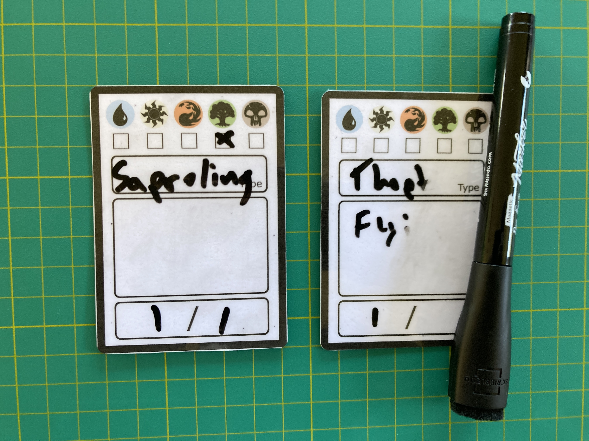
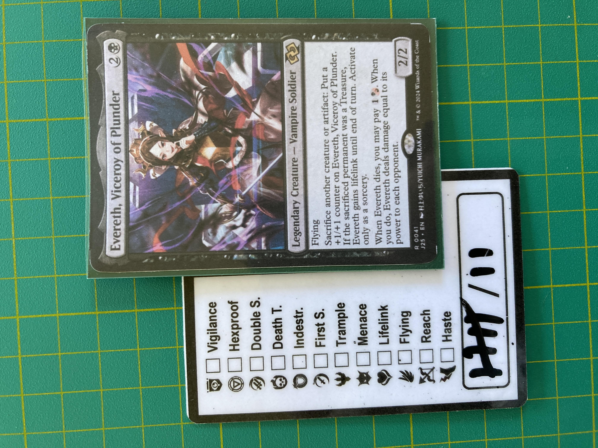
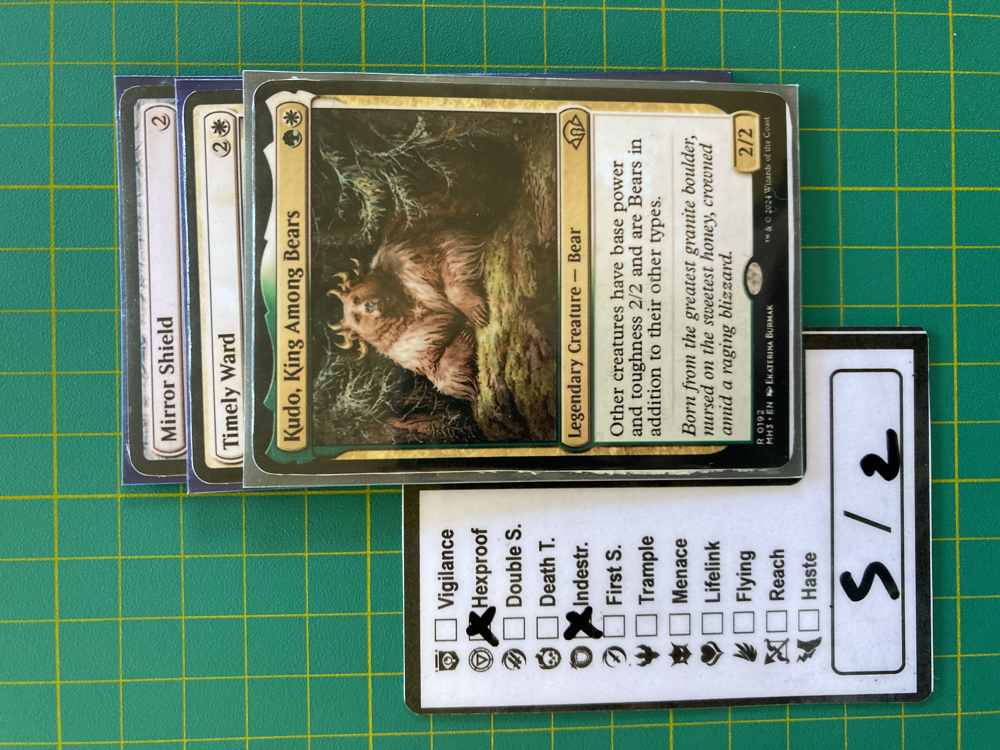

One of my on again off again obsessions is Magic the Gathering. My friends and I play a lot of commander which always requires lots of fiddly counters and a random assortment of tokens.

I got sick of using miscellaneous bits of paper to represent tokens so I designed these dry erase tokens.

The front of the token can be used to represent tokens, with a space for indicating the color, type, power and toughness.

The back can be used to keep track of the overall strength of a roided out commander, or the number of +1/+1 counters on a creature.

 

## Make Your Own

- [Token side PDF](mtg_token_dry_erase_front.pdf)
- [Counter side PDF](mtg_token_dry_erase_back.pdf)

Tips:
 - I like to make my tokens double sided. If you want to do it this way, make sure that the paper aligns correctly in your printer, otherwise you can end up with parts of the card that get cut. If your printer can do double sided print jobs then this may not be an issue.
 - MAKE SURE YOU PRINT AT 100% size! Otherwise the tokens will be smaller than a standard magic card
 - Use 8.5in by 11in paper. A4 will probably work as well, just make sure it's scaled correctly.
 - I like to use card stock instead of regular printer paper. It makes the cards feel nice and hefty

Once you've printed out the tokens you can either laminate them and then cut them or cut them and put packing tape on the front. 

## Remix the Design

The original SVGs for the cards [are available here](tokens.svg). You can use any vector editor such as [Inkscape](https://www.inkscape.org/) or Adobe Illustrator. The designs are licensed under the [MIT open source license](https://mit-license.org/), so feel free to use, modify and re-distribute them!
